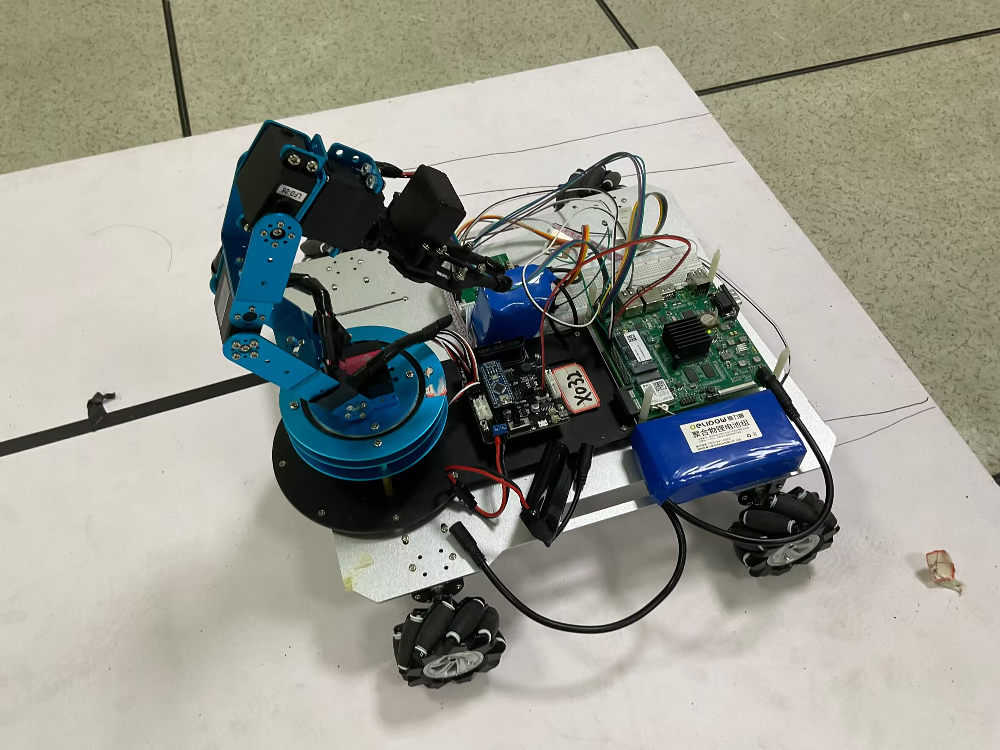
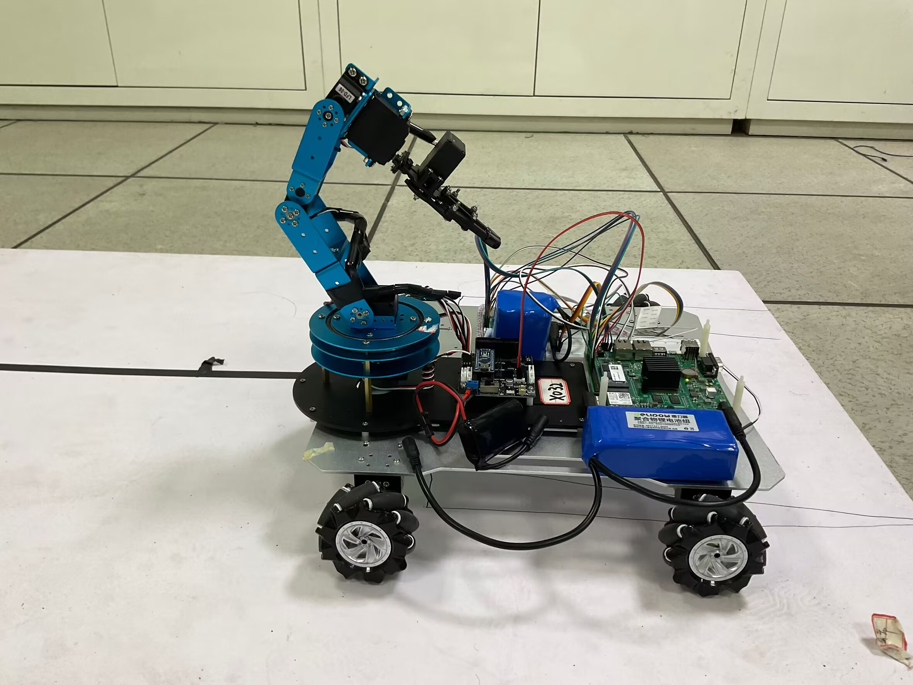
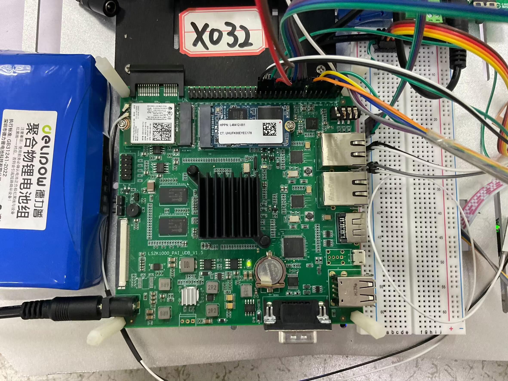
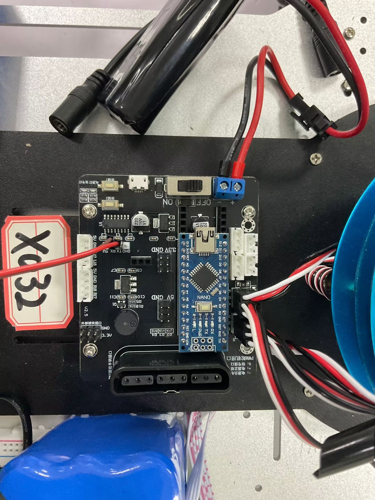

# 全国大学生嵌入式芯片与系统设计竞赛

## 实物展示

（1）机械部分和电路部分展示

整体斜视：

机械部分：

龙芯2k1000电路部分：

机械臂电路部分：

驱动电路部分：

（2）操作视频展示

## 功能与特性

（1） 自主导航： 利用龙芯开发板控制的小车能够在复杂环境中进行寻迹，自主导航到目标位置。 这一功能基于算法实现路径规划和避障， 使得系统在没有人工干预的情况下独立运作。

（2） 物体识别： 集成的 yolov5 模型使得系统能够实时识别不同的物体。 这种深度学习模型提供了高精度的识别能力， 能够处理多种物体， 并具有很好的适应性和鲁棒性。

（3） 机械臂操作： 系统配备了精密控制的机械臂， 能够在识别物体后准确地抓取并搬运物体。 这一机械臂通过精确的伺服控制， 可以在多个自由度上操作， 适应各种抓取和搬运任务。

（4） 任务执行与定位精度： 系统不仅能抓取物体， 还能将物体精确放置在指定位置。 这一功能对于需要高精度定位的应用场景（如组装线） 尤为关键。

（5） 易于集成与扩展： 该系统设计考虑了与其他自动化和智能系统的集成，提供了一定的接口和协议， 支持未来功能的扩展和升级。

## 应用领域
项目属于机器人视觉和自动化控制的交叉领域， 具有广泛的应用前景。 以下是一些可实现的应用领域和潜在用途：

（1） 仓库物流管理： 在自动化仓库中， 我们的系统可以用来识别和搬运库存。 小车可以在仓库内自主导航， 识别并拾取物品， 然后将它们运送到装运区或存储位置。 这种自动化可以显著提高仓库操作的效率和减少人力成本。

（2） 智能制造： 在制造行业， 我们的系统可以用于组装线， 自动识别和搬运组件。 机器人可以在生产线上自动执行复杂的组装任务， 提高生产效率并减少错误率。

（3） 灾难响应和搜索救援： 在灾难现场， 如地震或火灾后， 我们的系统可以被部署来搜寻生存物资或救援设备， 并将它们运送到需要的地点， 帮助救援队快速响应。

（4） 农业自动化： 在农业应用中， 类似的系统可以用于自动化采摘， 如识别成熟的水果并进行收集， 提高农业生产效率。通过集成先进的图像识别技术和精确的机械操作， 我们的系统不仅提高了操作的自动化水平， 还为多种工业和非工业应用提供了可靠的技术支持。
